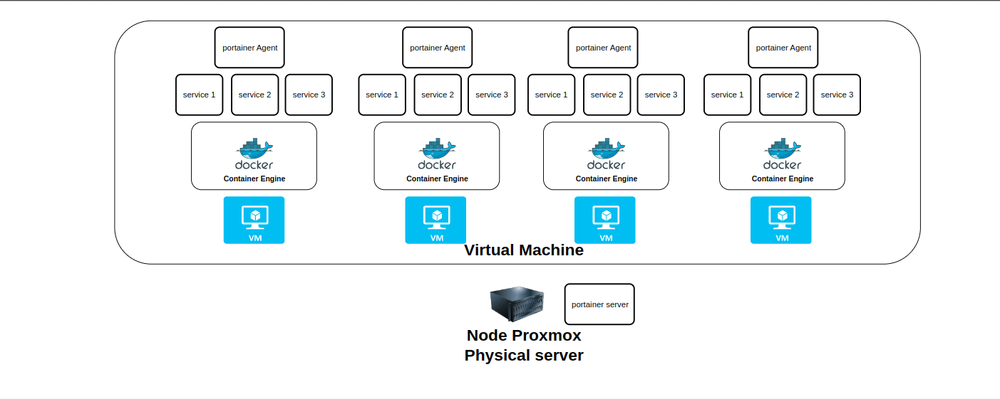
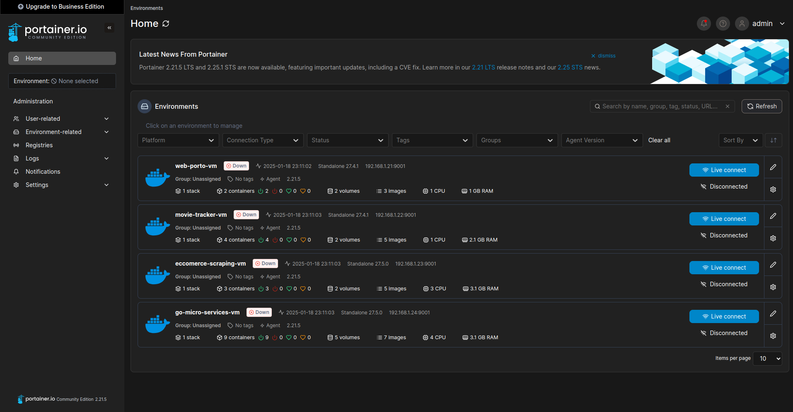

# Home Server Project

## The Beginning

### How It All Started 🚀  

On **January 9, 2025**, I decided to start building a home server after failing with a VPS.  

### The Problem 🤦  
The failure was entirely my fault—I purchased a VPS with a data center located far from my country.  
- I live in **Jakarta**, but the VPS data center was in **India**, causing terrible latency.  
- Frustrated, I gave up on that VPS.  
- Fortunately, the provider offered refunds, so I got my money back and learned a valuable lesson.  

### The Turning Point 💡  
Even after that, I still wanted to:  
1. Deploy my projects and portfolio online.  
2. Understand how production environments work.  

But instead of buying another VPS, I stumbled upon something more exciting.  

While scrolling through YouTube, I found [this video](https://www.youtube.com/watch?v=wMSxYOZMl0U&feature=youtu.be) that showed how you could build a server at home using an **old laptop**.  
- I immediately decided to try it.  
- After spending a day understanding the video, I installed **Proxmox** on my laptop and turned it into a home server.  

### The Learning Curve 📚  
During that week, I dived into:  
- **Networking Basics**: How to make my local server accessible to the internet.  
- **Computer Fundamentals**: How computers were created and how they work.  
- **Internet Mechanics**: How data travels and how everything connects.  

### A Surprising Realization 🤔  
One thing that stood out to me:  
- Internet connections aren’t fully wireless!  
- At least in my country, ISPs still rely on **cables** to deliver internet access.  

Learning all of this completely changed the way I think about computers and the internet.  

## Deployment Journey on My Home Server

## 🗓️ January 19, 2025: First Milestone Achieved! 🎉

Hello, guys! Today, I’m excited to share how I managed to **deploy my applications locally** on my very own home server. It’s been a learning-packed journey, and here’s a detailed breakdown of what I’ve done so far:

---

## 🚀 My Deployment Setup

### 🌐 Virtualization Technology
I’m using **virtualization technology** to manage my applications effectively. Here’s how I set it up:
- Created **4 Virtual Machines (VMs)** using **Proxmox**.
- Each VM runs my applications inside **Docker containers**.

---

### 🐳 Why Docker?  
Docker is amazing because it allows me to:
1. **Package my programs** along with all their dependencies.
2. Easily add essential services like:
   - **Databases** (PostgreSQL, MySQL, etc.)
   - **Messaging servers** (RabbitMQ, Kafka, etc.)
   - **Caching servers** (Redis).

With Docker, everything is modular, portable, and easy to replicate! 💡

---
### 🛠️ Simplifying Management with Portainer

Managing multiple Docker environments across VMs can be challenging. To make this process easier, I decided to use **Portainer**, a lightweight and user-friendly tool for managing Docker containers. Here’s my setup:  

1. Installed the **Portainer Agent** on each VM to enable communication between the VMs and the main server.  
2. Installed the **Portainer Server** on my Proxmox node to centralize control and management.  

With this setup, I can now monitor, deploy, and manage all Docker containers across my VMs from a single **Portainer dashboard**.  

---

### 🖼️ Current Server Architecture

Here’s a visual representation of my current server architecture:  

  

#### Explanation:
1. **Proxmox Node**: Serves as the hypervisor managing all virtual machines.  
2. **Virtual Machines (VMs)**: Each VM runs specific applications inside Docker containers. These applications might include services such as databases, message queues, or cache servers (e.g., Redis).  
3. **Portainer Server**: Installed on the Proxmox physical node to centralize Docker container management across all VMs.  
4. **Portainer Agents**: Installed on each VM to facilitate communication and management via the Portainer Server.  

This architecture allows me to run isolated environments for different services while still managing everything efficiently through Portainer.  

#### Why This Setup Works:
- **Isolation**: Each VM can host independent services without interference.  
- **Scalability**: Adding more VMs or containers is straightforward as the Portainer setup supports multiple environments.  
- **Efficiency**: With Portainer, I don’t need to manage each VM individually; all tasks can be centralized.  

Here’s the diagram:  

  

---  
Stay tuned for next week’s update, where I’ll experiment with using LXC (Linux Containers) to compare performance and efficiency against VMs.  

## 💻 My First Week: Setting Up the Server

During the first week:
1. I figured out how to **set up a home server**.
2. Learned to deploy my applications inside the server using VMs.  
3. Integrated **Portainer** for centralized management of Docker environments.

**Fun Fact:** In Proxmox, there are two ways to deploy applications:
- Using **VMs** (Virtual Machines).
- Using **LXC containers** (Linux Containers).

For now, I chose **VMs** to deploy my projects. However, next week, I plan to explore **LXC containers** to compare their efficiency.

---

## ⚡ Why Explore LXC Containers?

Currently, my old laptop (repurposed as a server) can handle **4 VMs**, but that seems to be the maximum it can handle comfortably. I’m curious to see if **LXC containers** will:
- Be **more efficient** for my hardware.
- Allow me to run more containers compared to VMs.

---

## 🛠️ What’s Next?

Next week, I’ll:
1. Deploy the same projects using **LXC containers**.
2. Compare the performance of VMs vs. LXC to determine the best solution for my needs.

Stay tuned for the update! Let’s see if my old laptop server can handle the challenge. 😄

---

## 📋 Summary
- 🖥️ Set up 4 VMs in Proxmox.
- 🐳 Deployed apps using Docker containers.
- 🛠️ Installed **Portainer** for centralized management.
- 🔍 Next step: Test LXC containers for better performance.

---

### 🌟 Feedback & Suggestions
If you have any tips, tricks, or suggestions on deploying apps on a home server, feel free to share! This repo is as much about learning as it is about sharing. 😊

See you in the next update!
